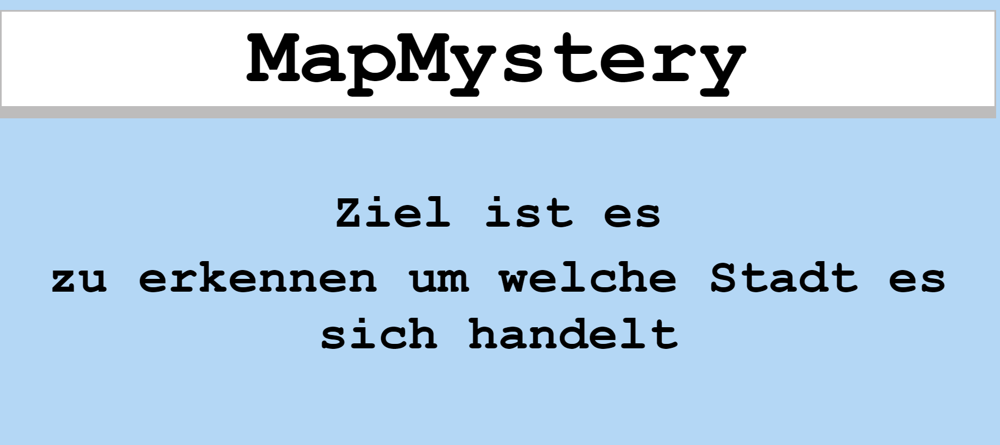
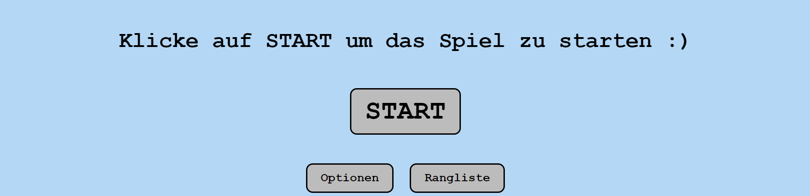
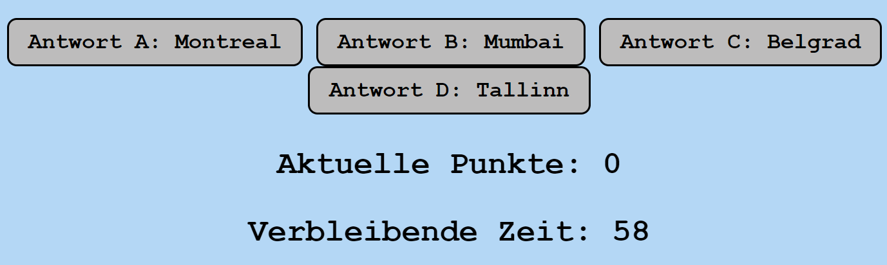
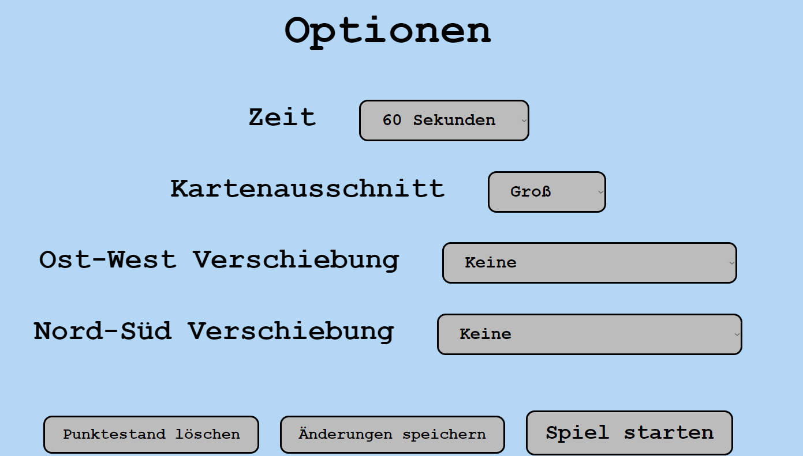
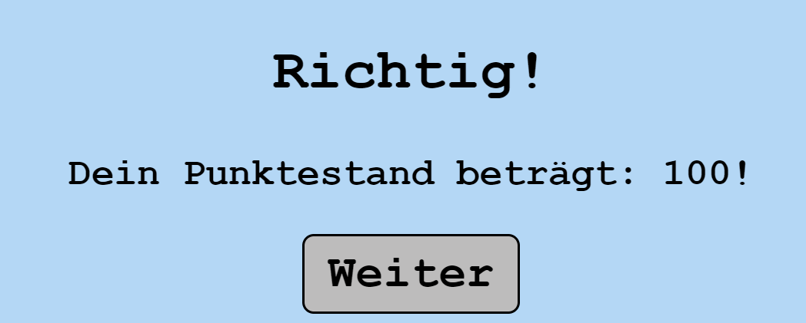
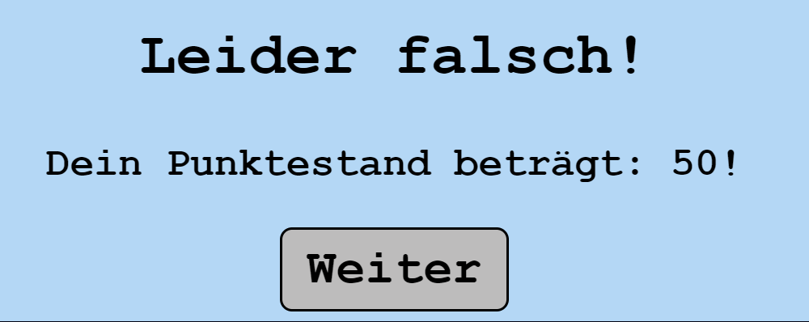

# praktikum-block-02-javascript-game-mib-die-wahren-zweitis
praktikum-block-02-javascript-game-mib-die-wahren-zweitis created by GitHub Classroom

<!-- PROJECT LOGO -->
 

  

  

    A small interactive game where you have to guess where you are  

<!-- TABLE OF CONTENTS -->

  
Table of Contents

  <ol>
    <li>
      <a href="#about-the-project">About The Project</a>
    </li>
    <li>
      <a href="#getting-started">Getting Started</a>
    </li>
    <li><a href="#usage">Usage</a></li>
    <li><a href="#roadmap">Roadmap</a></li>
    <li><a href="#contact">Contact</a></li>
  </ol>

<!-- ABOUT THE PROJECT -->
## About The Project

This is the second project from the group "Die wahren zweitis".

Our mission was to create a small functional game. 

We decided to make a similar game as "Geoguesser". This is a game where the player has to find out where he is in the world using streetview.

We have changed the concept a bit. With us the player gets a map section where he sees street names etc. and with this info he has to indicate the city where the he is located.

(<a href="#readme-top">back to top</a>)

<!-- GETTING STARTED -->
## Getting Started

For running this game, you just have to open the code in "Visual Studio Code" and run it with the Live Server of 'index.html'.

<!-- USAGE EXAMPLES -->
## Usage
The game has a few features besides to the map section.

During the game you will be given four countries to choose from to decide which one you are in.
There is a limited time to decide.

You as a player can choose the difficulty level yourself before the start and decide how much time you have per turn and what size the map section should have. The shifting of the map section can also be selected

During the game, points can be collected but also lost. At the end you have the opportunity to see your score in a ranking list

All these features have their own class and thus you have the opportunity to view each individual code and view the connection

<!-- ROADMAP -->
## Roadmap

- [ ] Design the logo and the look of the site
- [ ] Add Map and define the map section
    - [ ] Add Cities to choose of
- [ ] add wrong, right & time-Over Screen
- [ ] add options 
    - [ ] choose diffuculty (time, map section & shifitng of map section)
- [ ] add leaderboard

(<a href="#readme-top">back to top</a>)

<!-- CONTACT -->
## Contact
Mattis Depoorter - m.depoorter@web.de
Jasmin Herrmann - herrmannjasmin581@gmail.com 
Gunta Japina - japina.gunta@gmail.com

Project Link: [https://github.com/HFU-DM-GIS/praktikum-block-02-javascript-game-mib-die-wahren-zweitis](https://github.com/HFU-DM-GIS/praktikum-block-02-javascript-game-mib-die-wahren-zweitis)

(<a href="#readme-top">back to top</a>)

